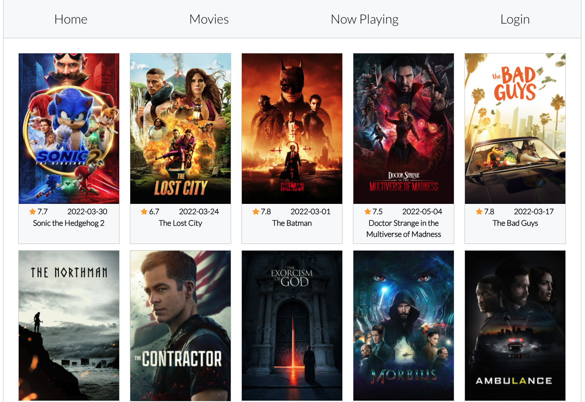

## Movie Reviewer Database App - Part 4

## Authentication 

Many web applications are a mix of public and private pages. 

You can use `authentication` to manage which users have access to which pages.  These `pages` will results in protected and public routes. Protected routes let us choose which routes users can visit based on whether they are logged in. 

For example, you might have public routes that you want anyone accessing, like a landing page, a pricing page, and the login page. Protected routes should only be available to users that are logged in, like a dashboard or settings page.

## Common React Design Libraries (aka. Component Library, UI Framework, etc)

### Reactstrap

<a href="https://www.npmjs.com/package/reactstrap">Reactstrap</a>

### MaterialUI

### Formik

### Be Aware of Bundle Size

https://www.smashingmagazine.com/2022/05/you-dont-need-ui-framework/

https://bundlephobia.com/

## References
