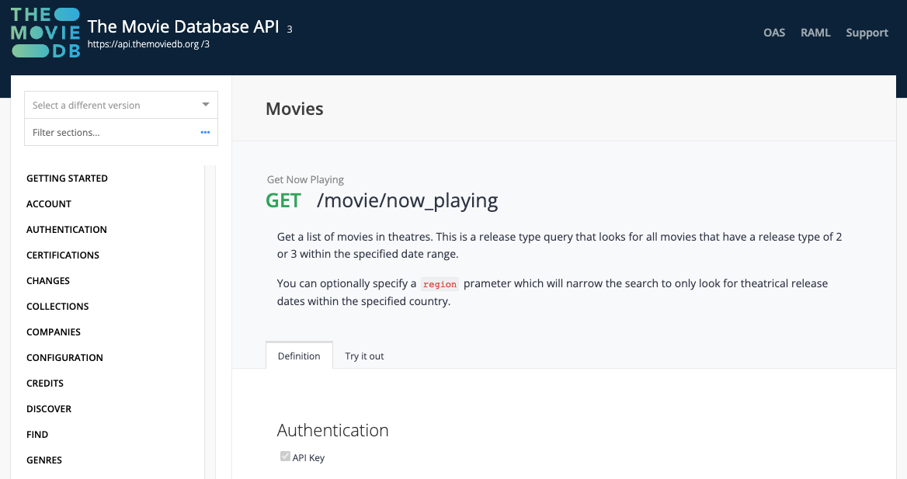
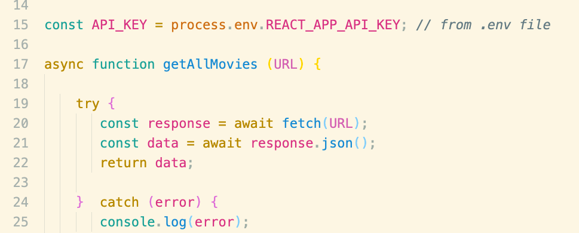
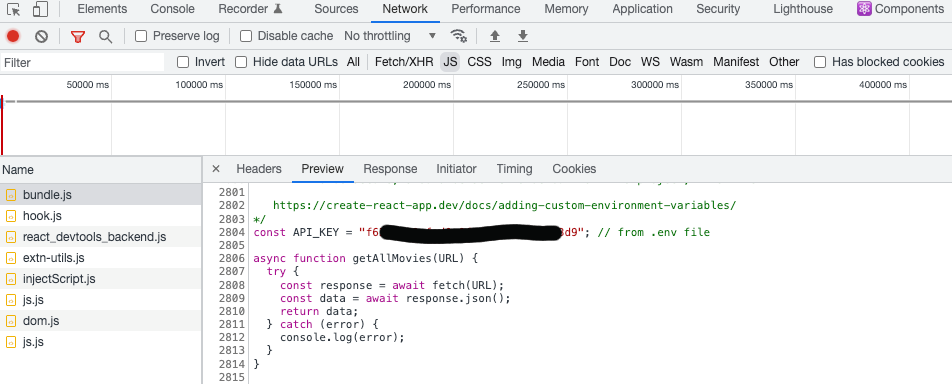

## Movie Reviewer Database App - Part 4

## Authentication 

Most applications allow users to register and log in using the credentials they set. The custom credentials prove they are who they say they are.

Authentication is a crucial feature for any application that allows users to create, update, or delete data. Most apps these days would not be complete without authentication because it's what allows users to have an identity on your website or app.

Authentication provides password protection to hide content from unauthorized users. It lets you serve content specifically to a user, as well as customize their settings and experience.

### Basic Authentication

There are many ways to authenticate a user on the web. One of the most common (and easiest) ways to set up authentication in your application is using the "Basic" HTTP authentication scheme – or "Basic Auth".

The Basic Authentication scheme is part of the overall authentication framework provided by HTTP (see <a href="https://developer.mozilla.org/en-US/docs/Web/HTTP/Authentication">this page</a> on MDN web docs for more information).

When the client wants to authenticate itself with a server (for example, log in a user), it can do so by including an Authorization request header with the user credentials. Basic Auth transmits the credentials as user ID/password pairs, which are encoded using an encoding scheme called base64.

You can use `authentication` to manage which users have access to which pages.  These `pages` will results in protected and public routes. Protected routes let us choose which routes users can visit based on whether they are logged in. 

For example, you might have public routes that you want anyone accessing, like a landing page, a pricing page, and the login page. Protected routes should only be available to users that are logged in, like a dashboard or settings page.

## API Keys

### .env

## Common React Design Libraries (aka. Component Library, UI Framework, etc)

### Reactstrap

<a href="https://www.npmjs.com/package/reactstrap">Reactstrap</a>

### MaterialUI

### Formik

### Be Aware of Bundle Size

https://www.smashingmagazine.com/2022/05/you-dont-need-ui-framework/

https://bundlephobia.com/

## References
