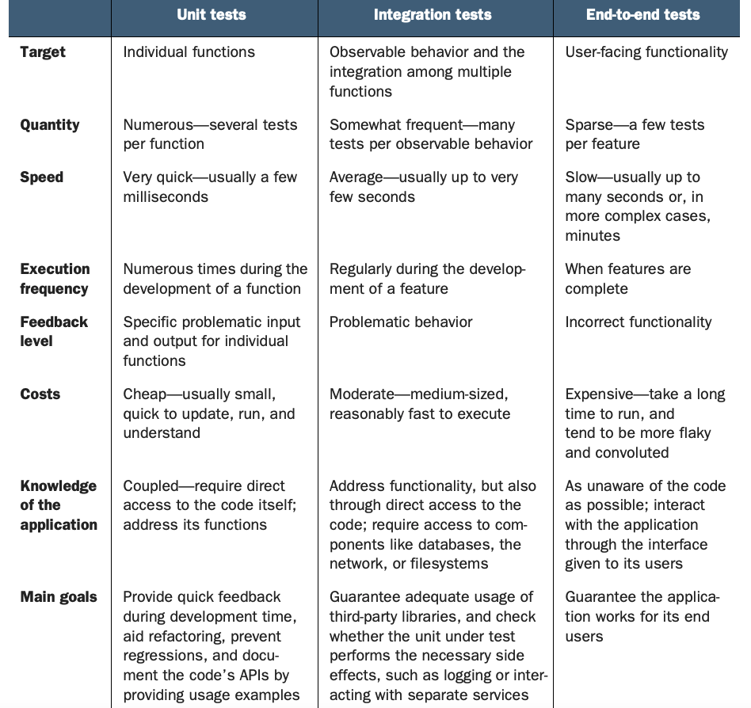

## Testing

Testing refers to the process of writing tests for our code based on what we expect to happen and then running our code against those tests. Our code will be considered successful if it passes the tests that we write for it. 

The idea is that we determine from the start what we expect a function or a component to do, write tests to reflect these expectations, and then put our components up against these tests. If they behave the way we expect, then we can move on. Otherwise, we need to refactor our code to pass the tests. 

There are several common kinds of testing:

- Unit Testing: Used to test a single function.
- Endpoint Testing: Used to test an endpoint. Postman tests would be an example of this.
- Component Testing/Mocking Components: Testing a component in a simulated environment.
- End to End Testing: Simulates a user interacting with the website.

### Test Driven Development

TDD, is a philosophy of first determining what you want your code to do and writing tests that your code will need to pass, and then writing the code.

TDD often takes place at the level of individual functions.

Test-driven development benefits you, the developer, in the following ways:

- It helps you fully understand the requirements for your function because you have to express them by writing test code. This also helps other people understand your code.
- It helps you relax when code doesn't work. This attitude will help you think more clearly when debugging.
- It helps you fearlessly refactor and improve your code when you need to, because the tests will let you know if you break anything.
- It helps you frequently experience the joy of working code, because getting a test to pass feels great.

#### To begin applying TDD to a function, follow the process detailed below:

- Determine inputs, outputs, and the function name. Put another way, what does the function do?
- Determine the happy path. The term happy path refers to the common scenario for using a function. So determining the happy path means ignoring any exceptions or odd cases (such as a missing parameter).
- Write the smallest test possible. For example, you may write a test that just checks whether or not the function exists.
- Write code to make the test pass. If you are testing for whether or not the function exists, you may just write the function.
- Repeat steps, updating the test to check for the next step on the road to the happy path. For example, the next test that you write maybe that it returns a value.
- Consider alternative cases and exceptions. For example, what should happen if a parameter is missing?

Benefits of testing:

- You know exactly what you expect to happen right from the start. This reduces debugging time as it allows you to develop in a more isolated environment
- Allows you to think through your logic beforehand and find any holes you may not have intended.



### Jest

Jest is a unit testing library which allows us to perform unit tests. It comes out of the box with create-react-app. When bootstrapping a project with create-react-app, all of our tests must be included in the `src` directory and will not be compiled on build.

Normally you would either create a `__tests__` folder and keep all of your test files there or create a separate test file with `.test` in the file name (e.g. `app.test.js`).

Jest is a test runner which can be considered your testing environment which runs your test(s). It is also an assertion library which verifies that things are correct or not. It uses Jasmine behind the scenes.

> There are other testing libraries like Mocha (test runner) and Chai (assertion library).

#### Running your tests

When you use `create-react-app` there is a script already created to run your Jest tests:

```npm run test```


```JS
// App.js:

export const add = (value1, value2) => { 
    return value1 + value2;
};

export const total = (shipping, subTotal) => {
    return '$' + add(shipping, subTotal);
};

export function highestScore(students) {
    let result = null;
    let highScore = 0;
  
    for (let i = 0; i < students.length; i++) {
      let student = students[i];
      if (student.score > highScore) {
        highScore = student.score;
        result = student;
      }
    }
  
    return result;
}
```

```JS

// App.test.js:
   
import { add, total, highestScore } from './App';

// unit tests - single function test

test('add - if function defined?', () => {
  expect(add).toBeDefined(); 
});

test('add - is function returning a value?', () => {
  expect(add(1, 2)).toBeDefined();
});

test('add - verify correct return values', () => {
  expect(add(1, 2)).toBe(3);
  expect(add(5, 2)).toBe(7);
});

test('highest score', () => { 
  const students = [
    { name: 'Shane Carey', score: 9.5 },
    { name: 'Rebecca Mills', score: 8.7 },
    { name: 'Derek Myers', score: 9.1 },
  ];
  const result = highestScore(students);
  expect(result).toEqual({ name: 'Shane Carey', score: 9.5 });
});

// integration test - function that relies on another function
test('total', () => {
  expect(total(2, 10)).toBe('$12');
  expect(total(8, 50)).toBe('$58');
});

```

### Testing React Components

You can also test entire React components, also called mocking components. To do this you use Facebook's native React testing library. This is also provided by `create-react-app`. 

This library will allow us to mount our components in a virtual environment and test them.


## Deployment


## Resources

- [Testing Overview](https://www.youtube.com/watch?v=u6QfIXgjwGQ)
- [Test Driven Development](https://www.youtube.com/watch?v=H4Hf3pji7Fw)
- [Intro to Jest](https://www.youtube.com/watch?v=FgnxcUQ5vho)
- [Jest - Getting Started documentation](https://jestjs.io/docs/getting-started)
- [React Testing Crash Course - Youtube](https://www.youtube.com/watch?v=GLSSRtnNY0g)
- [DOM Testing Library Documentation](https://testing-library.com/docs/dom-testing-library/intro)
- [React Testing Library Documentation](https://testing-library.com/docs/react-testing-library/intro/)
- []()


