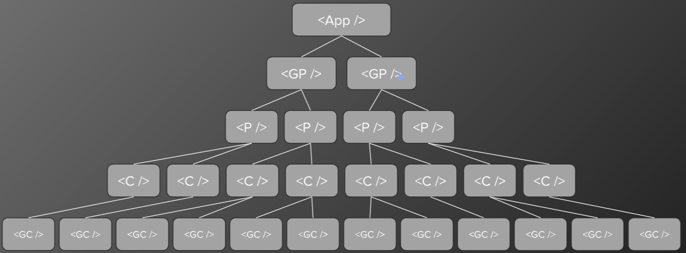
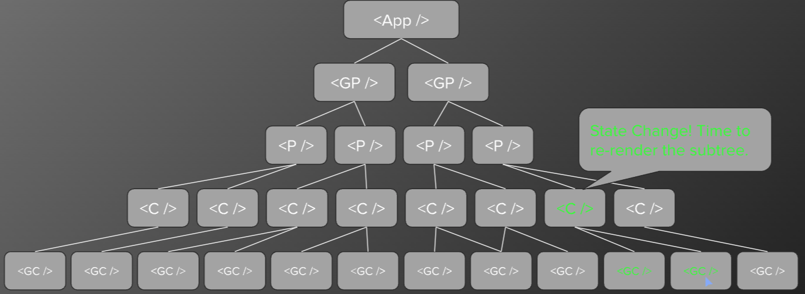

## Movie Reviewer Database App - Part 5

## React State Management - Beyond useState

### Context API

Conext provides a way to pass data through the component tree without having to pass props down manually at every level.

## React Performance 

### Profiler

### Lazy Loading with React.Lazy and Suspense

### useMemo

## Deployment

## React Tree Rendering

React renders each child recursively before rendering the next child component and its children. So React renders each compoment branch, one branch at a time.

 1. GrandParent => Parent => Child => GrandChild
 2. GrandParent => Parent => Child => GrandChild

Changes to state or props in any component will recursively re-render down the remaining tree whether those components have changed or not.

How do you stop the child re-rendering if they do not need to? (e.g. state or props are not passed to those children components).

### useMemo 

useMemo() is a built-in React hook that accepts 2 arguments — a function compute that computes a result and the depedencies array:

const memoizedResult = useMemo(compute, dependencies);

